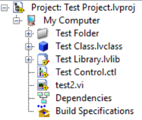
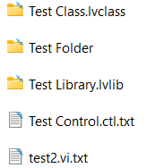

# VI2String
Turn LabVIEW files into "tagged text file". 

I use these codes to apply "Chinese Copyright of Computer Software" (CCCS, 中国计算机软件著作权) for my LabVIEW programmes. CCCS requires submitting text codes instead of G codes, so here comes this repo. Maybe it will also be useful in other cases.

## How It Works?
```Test.vi``` is an example to turn a LabVIEW project ```Test Project.lvproj``` into a folder of text files that mirroring the project hierarchy. And these ```.txt``` files are exactly what you can get from ```Export String``` invoke node or by clicking  ```Tools->Advanced->Export Strings ```



## Supported Item/File Type
- [x] .vi
- [x] .ctl
- [x] .lvclass
    - [x] private data control
    - [x] Property Definition
    - [x] Methods
- [x] .lvlib
- [x] Virtual Folder
- [ ] Documents (non-LabVIEW files in a project)
- [ ] Dependencies
- [ ] Build Specs
- [ ] .lvproj
